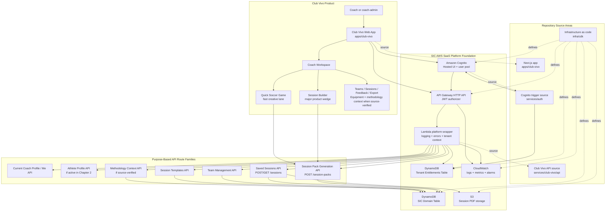

# Club Vivo SaaS Architecture Mermaid

## Status

Draft Chapter 2 presentation diagram.

This document is documentation-only. It does not change app code, backend code, infrastructure, auth, tenancy, IAM, entitlements, DynamoDB keys, routes, Lambdas, or public API contracts.

## Purpose

This diagram presents Club Vivo as the product and Sports Intelligence Cloud as the AWS SaaS platform foundation behind it.

The diagram is intentionally conservative:

- Session Builder is the major product wedge.
- Quick Soccer Game is the fast creative lane inside the shared Club Vivo workflow.
- Equipment Essentials and Methodology are shown only as source-present or near-term context unless source inspection confirms standalone shipped workspace behavior.
- Quick Soccer Game reuses the shared Session Builder route family. It is not a separate backend product.
- Deployed Lambda names are not renamed or replaced by this diagram.

## Mermaid Diagram

## Layer Explanation

### Product Layer

The product layer is what a coach experiences. Club Vivo is the product name. The Coach Workspace organizes the current coaching workflow around Session Builder, Quick Soccer Game, saved sessions, feedback, export, teams, and conditional context areas.

Session Builder is the main deliberate planning path. Quick Soccer Game is the fast lane for creating a simple soccer activity from a smaller input contract. Both stay inside the shared Club Vivo product.

### Repository Source Layer

The source layer shows where the current repo keeps the main implementation surfaces:

- `apps/club-vivo` for the Next.js web app.
- `services/club-vivo/api` for Club Vivo API Lambda handler and domain source.
- `services/auth` for Cognito trigger Lambda source.
- `infra/cdk` for infrastructure as code.

This layer explains code ownership without renaming deployed resources.

### SIC Platform Foundation

SIC is the AWS SaaS platform foundation behind Club Vivo. It provides:

- Cognito authentication.
- API Gateway HTTP API access.
- Lambda request handling.
- server-built tenant context.
- DynamoDB entitlements and domain storage.
- S3 session PDF storage.
- CloudWatch logs, metrics, and alarms.
- CDK-defined infrastructure.

### Purpose-Based API Route Families

The diagram uses human-readable purpose labels instead of vague Lambda-style labels. The deployed Lambda names remain governed by `docs/architecture/chapter-2/lambda-naming-inventory.md`.

The important product relationship is that Session Builder and Quick Soccer Game both use the shared Session Pack Generation API path. Quick Soccer Game does not create a separate backend service, route family, data model, auth path, or tenancy path.

## Tenant-Safe Request Flow

1. A coach signs in through Club Vivo.
2. Cognito handles authentication.
3. The Club Vivo web app calls API Gateway with a validated token path.
4. API Gateway invokes the relevant Lambda route family.
5. The platform wrapper resolves tenant context from verified claims and authoritative entitlements.
6. If claims or entitlements are missing or invalid, the request fails closed.
7. Domain handlers receive server-built tenant context.
8. DynamoDB reads and writes remain tenant-scoped by key construction.
9. S3 storage uses tenant-scoped paths for exported session files.
10. CloudWatch records operational signals without changing tenant boundaries.

## Conservative Scope Notes

This diagram does not represent future or proposed systems as shipped runtime. It does not show Training Brief, DiagramSequence, RAG/vector search, autonomous agents, or Bedrock production generation as deployed product behavior.

Equipment Essentials and Methodology remain context or source-present support in this presentation unless a later source inspection confirms standalone shipped workspace behavior.
