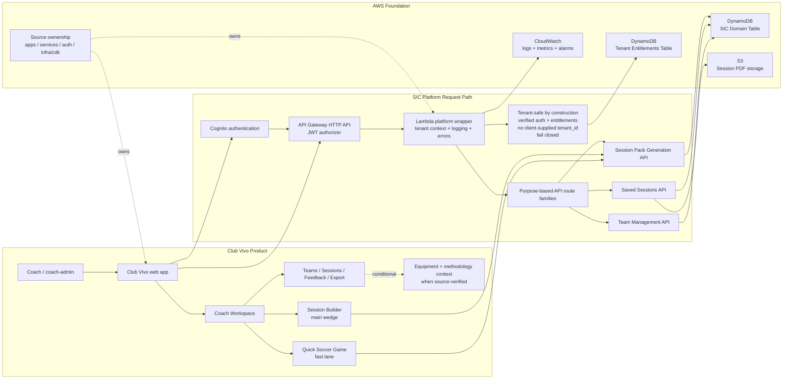

# Club Vivo SaaS Diagram Layout

## Status

Draft draw.io-ready layout source.

This document is documentation-only. It is intended as a source for creating a draw.io diagram. It does not change runtime behavior, infrastructure, auth, tenancy, IAM, entitlements, DynamoDB keys, routes, Lambdas, or public API contracts.

## Draw.io Use

Recommended workflow:

1. Open draw.io.
2. Create a blank diagram.
3. Use the canvas settings and shape table below for manual layout, or import the Mermaid source from the final section.
4. Keep labels purpose-based and easy to read.
5. Keep Equipment Essentials and Methodology conditional unless source-verified.
6. Do not add image analysis or future AI systems to the diagram.

## Canvas

Suggested canvas:

- width: `1600`
- height: `1000`
- orientation: landscape
- background: white

Suggested lane colors:

- Club Vivo product lane: `#EAF7F2`
- SIC platform lane: `#EAF2FF`
- AWS foundation lane: `#F6F7FB`
- tenant safety callout: `#FFF4D6`
- source ownership callout: `#F3ECFF`

## Lane Layout

| Lane | X | Y | Width | Height | Purpose |
| --- | ---: | ---: | ---: | ---: | --- |
| Title band | 40 | 24 | 1520 | 70 | Diagram title and subtitle |
| Club Vivo product | 40 | 120 | 1520 | 210 | Coach-facing product experience |
| SIC request path | 40 | 360 | 1520 | 250 | Auth, API entry, platform wrapper, route families |
| AWS foundation | 40 | 650 | 1520 | 210 | Storage, entitlements, observability, source/IaC |
| Scope guardrail | 40 | 890 | 1520 | 70 | Explicit non-claims and exclusions |

## Shape Table

| ID | Label | X | Y | W | H | Style |
| --- | --- | ---: | ---: | ---: | ---: | --- |
| title | Club Vivo on SIC SaaS Platform | 60 | 34 | 620 | 34 | bold title text |
| subtitle | Tenant-safe AWS serverless foundation for soccer coaching workflows | 60 | 70 | 780 | 24 | subtitle text |
| coach | Coach / coach-admin | 80 | 180 | 150 | 70 | product actor |
| web | Club Vivo web app | 280 | 170 | 170 | 80 | product box |
| workspace | Coach Workspace | 500 | 170 | 180 | 80 | product box |
| builder | Session Builder main wedge | 740 | 145 | 190 | 80 | product emphasis box |
| quick | Quick Soccer Game fast lane | 740 | 245 | 190 | 80 | product emphasis box |
| support | Teams / Sessions / Feedback / Export | 980 | 170 | 230 | 80 | product support box |
| context | Equipment + methodology context when source-verified | 1240 | 170 | 250 | 80 | conditional context box |
| cognito | Cognito authentication | 100 | 435 | 180 | 80 | platform box |
| apigw | API Gateway HTTP API JWT authorizer | 330 | 435 | 210 | 80 | platform box |
| wrapper | Lambda platform wrapper logging / errors / tenant context | 590 | 425 | 240 | 100 | platform emphasis box |
| tenant | Tenant-safe by construction | 880 | 385 | 300 | 110 | tenant safety callout |
| routes | Purpose-based API route families | 900 | 525 | 300 | 80 | route family group |
| sessionpack | Session Pack Generation API | 1230 | 405 | 240 | 70 | route box |
| sessions | Saved Sessions API | 1230 | 500 | 240 | 70 | route box |
| teams | Team Management API | 1230 | 595 | 240 | 70 | route box |
| entitlements | DynamoDB Tenant Entitlements Table | 100 | 715 | 230 | 80 | data box |
| domain | DynamoDB SIC Domain Table tenant-scoped keys | 380 | 715 | 230 | 80 | data box |
| s3 | S3 Session PDF storage tenant-scoped paths | 660 | 715 | 230 | 80 | storage box |
| cloudwatch | CloudWatch logs / metrics / alarms | 940 | 715 | 230 | 80 | ops box |
| source | Source: apps, services, auth triggers, infra/cdk | 1220 | 715 | 270 | 80 | source callout |
| guardrail | Not shown as shipped: image analysis, Training Brief, DiagramSequence, RAG, autonomous agents, Bedrock production generation | 80 | 910 | 1380 | 34 | guardrail text |

## Connector Table

| From | To | Label | Style |
| --- | --- | --- | --- |
| coach | web | uses | solid |
| web | workspace | opens | solid |
| workspace | builder | deliberate planning | solid |
| workspace | quick | fast activity lane | solid |
| workspace | support | reuse loop | solid |
| support | context | conditional context | dashed |
| web | cognito | sign in | solid |
| web | apigw | API calls | solid |
| cognito | apigw | JWT validation context | solid |
| apigw | wrapper | invokes route Lambda | solid |
| wrapper | entitlements | load authoritative tenant scope | solid |
| wrapper | routes | dispatch by purpose | solid |
| routes | sessionpack | generate pack | solid |
| routes | sessions | save / read / feedback / export | solid |
| routes | teams | team context | solid |
| builder | sessionpack | shared generation path | solid |
| quick | sessionpack | shared generation path | solid |
| sessionpack | domain | tenant-scoped records | solid |
| sessions | domain | saved sessions and feedback | solid |
| teams | domain | team records | solid |
| sessions | s3 | PDF export | solid |
| wrapper | cloudwatch | operational signals | solid |
| source | web | source ownership | dashed |
| source | wrapper | source ownership | dashed |

## Tenant Safety Callout Text

Use this exact text inside or beside the tenant callout:

```text
Tenant-safe by construction
- verified auth + entitlements
- no client-supplied tenant_id
- fail closed on missing context
- tenant-scoped DynamoDB + S3
```

## Purpose-Based Route Family Text

If the route-family group is expanded, use these labels:

- Current Coach Profile / Me API
- Session Pack Generation API
- Saved Sessions API
- Team Management API
- Session Templates API
- Athlete Profile API, only if active in Chapter 2
- Methodology Context API, only if source-verified

Do not use vague labels such as `LambdaAthletes`.

## Mermaid Import Source

Draw.io can import Mermaid through `Arrange > Insert > Advanced > Mermaid`. Use this as the initial diagram source, then apply the manual layout above for a polished presentation.



## Exclusions For The Draw.io Diagram

Do not include image analysis.

Do not draw these as shipped runtime behavior:

- Training Brief
- DiagramSequence
- RAG or vector search
- autonomous agents
- Bedrock production generation
- separate Quick Soccer Game backend
- separate admin app
- unwired export or lake route families
