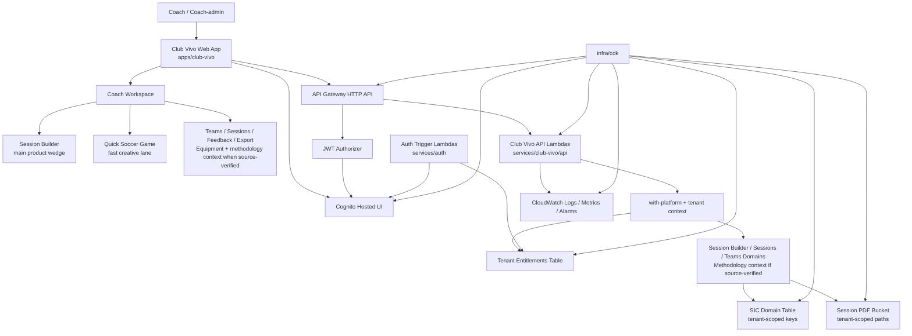

# Club Vivo SaaS Diagram Prompt

## Status

Draft prompt for a Chapter 2 architecture diagram.

Use this prompt to create a source-based diagram of Club Vivo on the SIC platform foundation. The diagram should be presentation-friendly but conservative. It must not invent shipped runtime behavior.

## Diagram Prompt

Create a clean SaaS architecture diagram for Chapter 2 of Club Vivo.

Show Club Vivo as the user-facing product and SIC as the AWS multi-tenant SaaS platform foundation behind it.

Audience:

- product reviewers
- technical reviewers
- nonprofit and club stakeholders
- future contributors

Diagram style:

- simple, professional, readable
- product layer at the top
- platform layer underneath
- AWS services grouped clearly
- tenant isolation visible
- no decorative complexity
- no unapproved future systems

Top layer:

- Coach or coach-admin user
- Club Vivo web app
- Coach Workspace
- Session Builder as the main product wedge
- Quick Soccer Game as the fast creative lane inside Club Vivo
- Supporting workspace areas: Teams, Sessions, Feedback, Export
- Source-present or near-term context callout: Equipment Essentials and Methodology only if source-verified

Application/source layer:

- `apps/club-vivo` as the Next.js web app
- `services/club-vivo/api` as the Club Vivo API Lambda source
- `services/auth` as Cognito trigger Lambda source
- `infra/cdk` as infrastructure source

AWS platform layer:

- Amazon Cognito Hosted UI and JWT authorizer
- API Gateway HTTP API
- Club Vivo API Lambda route families, using purpose-based labels:
  - Current Coach Profile / Me API
  - Athlete Profile API, only if still active in Chapter 2
  - Saved Sessions API
  - Session Templates API
  - Session Pack Generation API
  - Team Management API
  - Methodology Context API, only if source-verified

Lambda naming note:

- The diagram should use human-readable purpose labels.
- Actual deployed Lambda names may still differ until the Lambda naming inventory is reviewed.
- Do not use vague names like `LambdaAthletes` in presentation diagrams.

Additional AWS components:

- Auth trigger Lambdas:
  - Post Confirmation
  - Pre Token Generation
- DynamoDB:
  - Tenant Entitlements Table
  - SIC Domain Table
- S3:
  - Session PDF bucket
- CloudWatch:
  - logs
  - metrics
  - alarms

Tenant isolation callout:

- Tenant identity comes from verified auth plus authoritative entitlements.
- Client input must not provide `tenant_id`, `tenantId`, or `x-tenant-id`.
- Handlers receive server-built tenant context.
- Repositories and storage remain tenant-scoped by construction.
- Missing or invalid tenant context fails closed.

Main flow to show:

1. Coach signs in through Club Vivo.
2. Cognito authenticates and API Gateway validates JWT.
3. Lambda wrapper resolves tenant context from claims and entitlements.
4. Session Builder or Quick Soccer Game calls the shared `POST /session-packs` route.
5. Session output can be saved through `POST /sessions`.
6. Saved sessions can be reviewed, receive feedback, and export PDFs.
7. Data is stored under tenant-scoped DynamoDB keys and S3 paths.

Important exclusions:

- Do not draw Training Brief as shipped runtime.
- Do not draw DiagramSequence as shipped runtime.
- Do not draw RAG, vector search, or FAISS.
- Do not draw autonomous agents.
- Do not draw Bedrock production generation.
- Do not include image analysis in the Chapter 2 product story.
- Do not draw a separate admin app.
- Do not draw separate Travel or OST apps.
- Do not draw separate Quick Soccer Game backend services.
- Do not draw unwired export/lake route families as active deployed runtime.

Labeling:

- Title: `Club Vivo on SIC SaaS Platform`
- Product label: `Club Vivo`
- Platform label: `Sports Intelligence Cloud platform foundation`
- Main wedge label: `Session Builder`
- Fast lane label: `Quick Soccer Game`
- Safety label: `Tenant-safe by construction`

## Optional Mermaid Skeleton

